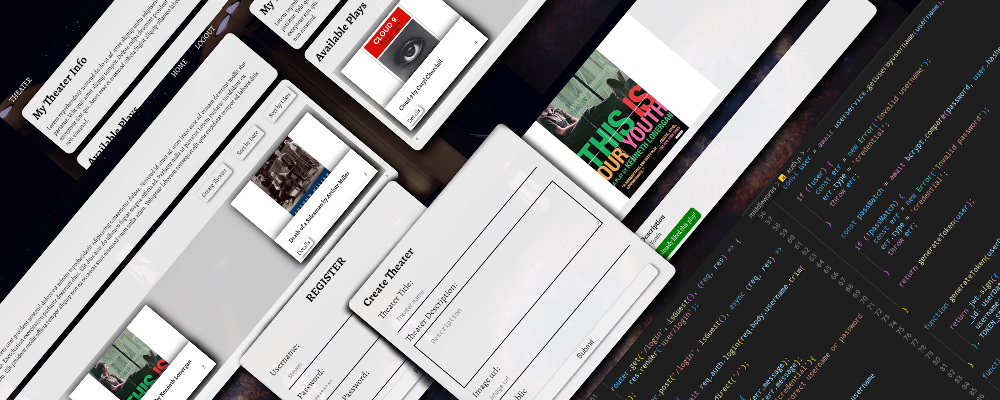

# theater-express

App use to be, collections of theater pieces owned from users that can like others collections, edit delete own pieces. Have route guards. On first start will be empty with no users or collection. DB run locally, so it's need  to be filled up.

Theater app, built with Express, it use handlebars for templating engine and mongoDB for database which is used locally. Also using Mongoose to simplify the work with database.

Some extra tools:JWT and cookie-parser for session, bcrypt for hashing,express-validator.

You can changes config setings at /config/index.js or just use .evn.
